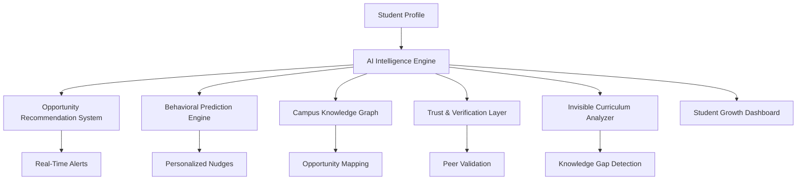

# College-Intelligence-Platform-for-First-Generation-Students

# 🎓 College Intelligence Platform for First-Generation Students

  
  
  
  

  <b>Bridging the Invisible Knowledge Gap in Higher Education Through AI & Community Intelligence</b>

---

# 🌍 Problem Statement

Every year, thousands of talented students enter colleges with equal intelligence but unequal access to opportunity.

First-generation college students often underperform not because they lack ability — but because they lack access to the “invisible curriculum” that privileged students inherit naturally through networks, seniors, alumni, and family exposure.

Critical opportunities are often hidden behind:

* Closed social circles
* Informal campus networks
* Unspoken faculty expectations
* Hidden club recruitments
* Last-minute scholarship information
* Professor-specific behavioral norms
* Silent placement pipelines

Students discover these realities only after missing opportunities.

This platform aims to solve that systemic inequality.

---

# 🎯 Vision

> “Access to opportunity should not depend on social privilege.”

The College Intelligence Platform transforms hidden institutional knowledge into a shared, AI-powered ecosystem where every student — regardless of background — receives timely, actionable, and verified guidance.

---

# 🚀 Project Overview

The platform is an AI-powered campus intelligence ecosystem where:

✅ Verified seniors share real opportunities
✅ AI predicts what students are likely to miss
✅ Freshers receive proactive nudges
✅ Students discover hidden pathways
✅ Institutional knowledge becomes democratized

The system combines:

* AI Recommendation Systems
* Community Intelligence
* Real-Time Opportunity Tracking
* Behavioral Prediction Models
* Peer Verification Systems
* Social Graph Analysis
* Personalized Student Roadmaps

into one unified student-support platform.

---

# 🧠 Core Innovation

# 🌟 Invisible Curriculum Intelligence Engine

The platform decodes and distributes the hidden rules of college success:

* How to approach professors
* Which clubs matter most
* Hidden placement pathways
* Research opportunity timing
* Informal networking strategies
* Scholarship survival tactics
* Department-specific success patterns

This knowledge is normally inaccessible to first-generation students.

---

# 🔥 Top 20 Innovative Features

# 1️⃣ “You’re About to Miss This” AI Nudge Engine

### Smart Predictions

Instead of static notifications, AI predicts:

> “3 students from your branch secured internships through XYZ Club applications closing tonight.”

### Why It’s Powerful

* Personalized urgency
* Behavioral prediction engine
* Proactive intervention system
* Context-aware notifications

---

# 2️⃣ Hidden Opportunity Radar

### Discover Invisible Opportunities

Students can submit:

* Research openings
* Startup internships
* Secretive club recruitments
* PPO-converting unpaid labs
* Hackathon team recruitments

### AI Categorization

The system classifies opportunities into:

* High ROI
* Low Effort / High Outcome
* Beginner Friendly
* Research Intensive
* Fast Growth Opportunities

---

# 3️⃣ Office Hour Intelligence Layer

### Faculty Behavior Intelligence

Examples:

* “Professor responds faster on LinkedIn.”
* “Bring project ideas before asking for LOR.”
* “Avoid attendance questions after class.”

### Purpose

Documents unspoken academic norms.

---

# 4️⃣ “Students Like You” Success Paths

### AI-Powered Inspiration Graphs

Example:

> “Students from Tier-3 CSE with 7–8 CGPA cracked Google STEP after completing these 3 actions.”

### Benefits

✔ Hope generation
✔ Actionable pathways
✔ Realistic role models

---

# 5️⃣ Expiring Intelligence Feed

### Dynamic Knowledge Prioritization

Time-sensitive posts automatically decay:

* Internship deadlines
* Scholarship openings
* Professor hiring windows
* Club recruitments

Fresh intelligence receives higher visibility.

---

# 6️⃣ Trust Score Based on Accuracy

### Reputation System

Contributors earn credibility when:

* Shared opportunities prove real
* Students benefit successfully
* Information remains accurate

### Result

Creates a trusted insider network.

---

# 7️⃣ AI “Decode This Opportunity” Assistant

### Input

Students paste:

* Internship forms
* Professor emails
* Scholarship announcements

### AI Output

The AI explains:

* Hidden expectations
* Selection criteria
* Ideal candidate profile
* Difficulty level
* Probability of selection

---

# 8️⃣ Opportunity Readiness Meter

### Inputs

* Resume
* Skills
* CGPA
* Academic year

### AI Prediction

> “You are 72% ready for ML internships.”

### Recommendations

The system identifies:

* Missing skills
* Weak areas
* Suggested projects
* Resume gaps

---

# 9️⃣ Department Survival Guide

### AI-Generated Guides

Examples:

* How to survive first-year ECE
* Most scoring electives
* Professors with difficult grading
* Subjects needing PYQs
* Lab survival tips

---

# 🔟 Reverse Mentorship Matchmaking

### Smart Mentor Matching

Instead of random mentors, students connect with seniors who were:

* From similar income backgrounds
* Same branch
* Similar CGPA range
* Hostel/day scholar
* Similar language preferences

### Emotional Impact

Creates relatable mentorship.

---

# 1️⃣1️⃣ “What Nobody Tells You” Anonymous Wall

### Anonymous Student Truth Layer

Students share:

* Toxic club culture
* Fake internships
* Exploitative professors
* Hidden placement cutoffs
* Scam campus ambassador programs

### AI Moderation

Content is:

* Reputation scored
* Moderated
* Pattern analyzed

---

# 1️⃣2️⃣ Opportunity Timeline Simulator

### Career Visualization Engine

Example:

> “If you want a Google internship in 3rd year, these milestones matter.”

### Timeline Includes

* Clubs
* Projects
* Referrals
* Contests
* Networking
* Application windows

---

# 1️⃣3️⃣ AI Weekly Action Planner

### Personalized Monday Plans

Every week the AI recommends:

* Events to attend
* Scholarships to apply for
* Professors to contact
* Skills to focus on
* Coding sheets to complete

### Goal

Convert awareness into execution.

---

# 1️⃣4️⃣ Campus Power Map

### Social Influence Visualization

Interactive graph showing:

* Influential clubs
* Placement pipelines
* Research labs
* Startup circles
* Faculty influence

### Insight Example

> “Students from Robotics Club disproportionately secure high-paying internships.”

---

# 1️⃣5️⃣ Scholarship Probability Predictor

### Inputs

* Category
* Income
* CGPA
* Branch
* Achievements
* Gender

### AI Predictions

* Selection probability
* Required documents
* Deadline risk
* Competitiveness level

---

# 1️⃣6️⃣ Missed Opportunity Recovery Engine

### Smart Recovery System

Example:

> “You missed Microsoft Engage, but here are 5 similar opportunities still open.”

### Impact

Reduces failure spirals.

---

# 1️⃣7️⃣ Real-Time Campus Alert System

### Breaking Opportunity Alerts

Examples:

* “Professor opened RA positions.”
* “Hackathon deadline extended.”
* “Company silently changed eligibility.”
* “Placement form closes in 2 hours.”

### Functionality

Campus intelligence works like live news.

---

# 1️⃣8️⃣ Toxic Pattern Detection AI

### AI Ethics & Accountability

The system identifies repeated complaints regarding:

* Fake internships
* Scam ambassadors
* Toxic professors
* Discriminatory practices

### Purpose

Creates institutional accountability.

---

# 1️⃣9️⃣ First-Gen Mode

### Empathy-Driven UX

Features include:

* College jargon glossary
* Acronym explanations
* “What is PPO?”
* “How referrals work”
* “What happens in office hours?”

### Mission

Reduce social disadvantage barriers.

---

# 2️⃣0️⃣ Opportunity Heatmap Across Colleges

### Nationwide Intelligence Network

Compare:

* Placement opportunities
* Scholarship distribution
* Club effectiveness
* Department growth patterns

### Long-Term Vision

Build India’s largest student opportunity intelligence graph.

---

# 🌟 BONUS FEATURE: Invisible Curriculum Score

## 🧠 Institutional Knowledge Intelligence

The platform estimates:

> “How much invisible institutional knowledge does this student currently possess?”

### The AI Detects Gaps In:

* Referral systems
* Research applications
* Networking etiquette
* Placement preparation
* Scholarship awareness
* Professor communication
* Club ecosystem knowledge

### Example Output

> “You are missing knowledge regarding:
>
> * Referral systems
> * Research outreach emails
> * Internship application timing”

### Why This Matters

This becomes a measurable indicator of social capital access.

---

# 🏗️ System Architecture

---

# ⚙️ Technology Stack

| Category              | Technologies                    |
| --------------------- | ------------------------------- |
| Frontend              | React.js, Next.js, Tailwind CSS |
| Backend               | Node.js, FastAPI                |
| AI/ML                 | OpenAI, LangChain, HuggingFace  |
| Database              | PostgreSQL, MongoDB             |
| Graph Intelligence    | Neo4j                           |
| Recommendation Engine | Python ML Pipelines             |
| Authentication        | Firebase/Auth0                  |
| Notifications         | Firebase Cloud Messaging        |
| Cloud                 | AWS / Azure / GCP               |
| Analytics             | Grafana, Power BI               |

---

# 📊 Core Modules

| Module                           | Function                          |
| -------------------------------- | --------------------------------- |
| AI Nudge Engine                  | Predicts critical opportunities   |
| Knowledge Graph                  | Maps campus intelligence          |
| Trust Engine                     | Verifies contribution reliability |
| Opportunity Radar                | Detects hidden opportunities      |
| Student Readiness System         | Measures preparedness             |
| Mentor Matchmaking               | Connects relatable seniors        |
| Institutional Intelligence Layer | Tracks invisible curriculum       |

---

# 🎯 Target Users

## 👨‍🎓 First-Generation Students

* Lack social capital access
* Need mentorship pathways
* Miss hidden opportunities

## 🏫 Colleges & Universities

* Improve student outcomes
* Increase placements
* Support underserved communities

## 🚀 EdTech Platforms

* AI-powered student intelligence
* Career readiness ecosystems

## 🤝 NGOs & Social Organizations

* Educational equity initiatives
* Opportunity democratization

---

# 📈 Expected Outcomes

## Students

* Increased opportunity awareness
* Better placement outcomes
* Reduced information inequality
* Improved confidence
* Stronger mentorship access

## Colleges

* Higher student engagement
* Better placement statistics
* Increased scholarship utilization

## Society

* Reduced educational inequality
* Democratized institutional knowledge
* Increased social mobility

---

# 🔥 Innovation Highlights

| Innovation                  | Impact                            |
| --------------------------- | --------------------------------- |
| Invisible Curriculum Score  | Measures hidden knowledge access  |
| Campus Power Graph          | Visualizes opportunity ecosystems |
| AI Opportunity Nudges       | Prevents missed chances           |
| Peer-Verified Intelligence  | Builds trust networks             |
| Toxic Pattern Detection     | Enables accountability            |
| Opportunity Recovery Engine | Reduces failure spirals           |

---

# 🌍 Future Scope

* Nationwide student intelligence network
* AI-powered career navigation agents
* Cross-college opportunity exchanges
* Blockchain-verified achievement systems
* AI-generated mentorship roadmaps
* Regional language support
* Predictive placement analytics
* Autonomous scholarship recommendation systems

---

# 📚 Research Contribution

This project contributes toward:

* Educational Equity Systems
* AI for Social Good
* Human-Centered AI
* Campus Intelligence Networks
* Behavioral Recommendation Systems
* Opportunity Democratization
* Institutional Knowledge Mapping

---

# 👨‍💻 Ideal Roles & Relevance

This project demonstrates expertise for:

* AI Engineer
* Solution Architect
* Product Engineer
* Social Impact Technologist
* Full Stack Developer
* Human-AI Interaction Researcher
* Recommendation System Engineer
* EdTech Innovator

---

# 🚀 Why This Project Stands Out

✨ Solves a real societal problem
✨ Emotionally compelling use-case
✨ AI + social impact integration
✨ Strong startup scalability
✨ Highly demo-friendly architecture
✨ Data-driven educational equity
✨ Massive national expansion potential

---

# 📬 Collaboration & Contributions

We welcome:

* AI Researchers
* Student Communities
* Open Source Contributors
* EdTech Startups
* Social Organizations
* Universities

### Contribution Areas

* AI recommendation systems
* UX improvements
* Opportunity datasets
* Campus intelligence APIs
* NLP moderation systems
* Mentorship integrations

---

# ⭐ Final Thought

Success in college is often determined not by intelligence — but by access to hidden information.

This platform transforms:

❌ Privileged Institutional Knowledge
➡️
✅ Shared Community Intelligence

so that every student — regardless of background — gets a fair chance to succeed.

---

  <b>⚡ Democratizing Opportunity Through AI-Powered Campus Intelligence ⚡</b>

